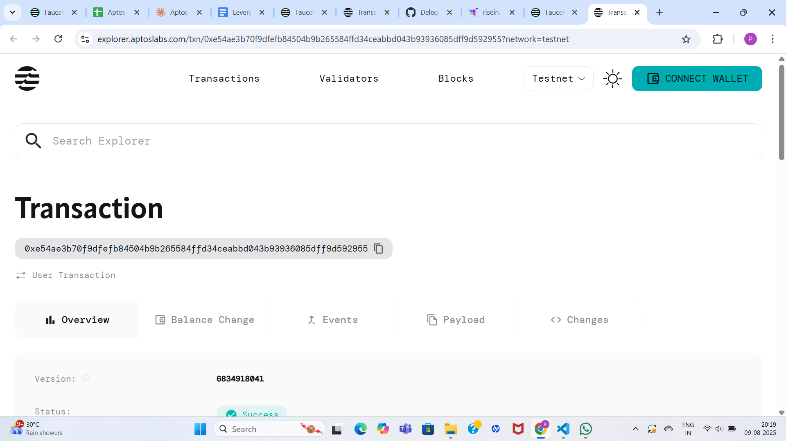

# Aptos Vault System

## Project Description

The Aptos Vault System is an optimized smart contract built on the Aptos blockchain that provides secure token management and distribution capabilities. This project represents a significant improvement over traditional vault implementations by directly using vault addresses instead of deriving them from admin addresses, resulting in enhanced gas efficiency and improved security. The system enables administrators to create secure vaults, deposit AptosCoin tokens, allocate them to specific recipients, and manage withdrawals with comprehensive access controls and event tracking.

## Project Vision

Our vision is to revolutionize decentralized token management by creating a robust, efficient, and secure vault ecosystem that empowers:

- **Enhanced Financial Infrastructure**: Building the foundation for next-generation DeFi applications with optimized gas usage and streamlined operations
- **Transparent Asset Management**: Providing clear, auditable, and tamper-proof token allocation and distribution mechanisms
- **Developer-Centric Design**: Offering simple, intuitive APIs that reduce complexity while maintaining security and functionality
- **Scalable Solutions**: Creating a system that can handle both small-scale individual use cases and large-scale institutional requirements
- **Community Empowerment**: Enabling secure token distribution for DAOs, community projects, and organizational treasury management

## Key Features

### 🏦 **Optimized Vault Architecture**
- **Direct Address Access**: Eliminates redundant address derivation calls for improved gas efficiency
- **Resource Account Integration**: Utilizes Aptos resource accounts for enhanced security isolation
- **Admin-Controlled Operations**: Secure administrative functions with proper access control mechanisms
- **Ownership Transfer Capability**: Seamless admin succession with secure ownership transfer functionality

### 💰 **Comprehensive Token Management**
- **Flexible Deposit System**: Admins can deposit AptosCoin tokens with automatic balance tracking
- **Intelligent Allocation Logic**: Precise token allocation with over-allocation prevention
- **Controlled Withdrawal Mechanism**: Secure withdrawal of unallocated tokens while protecting allocated funds
- **Balance Segregation**: Clear separation between total vault balance and allocated funds

### 🔒 **Advanced Security Features**
- **Multi-Layer Access Control**: Robust admin verification using vault-stored credentials
- **Balance Protection Mechanisms**: Prevents unauthorized access and over-spending scenarios
- **Comprehensive Error Handling**: Detailed error codes for different failure scenarios
- **Event-Driven Transparency**: Complete audit trail through comprehensive event emission

### 📊 **Real-Time Monitoring & Analytics**
- **Live Balance Tracking**: Real-time monitoring of total and allocated balances
- **Comprehensive Event Logging**: Detailed events for deposits, allocations, withdrawals, and ownership changes
- **View Function Accessibility**: Query vault and user states without transaction costs
- **Administrative Oversight**: Complete visibility into all vault operations and status

### ⚡ **Performance & Efficiency**
- **Gas Optimization**: Streamlined function calls with reduced computational overhead
- **Simplified Logic Flows**: Efficient contract design for faster execution
- **Direct Parameter Usage**: Eliminates unnecessary intermediate calculations
- **Optimized Data Structures**: Efficient storage and retrieval of vault information

## Future Scope

### 🌐 **Multi-Token Ecosystem**
- **Universal Token Support**: Extend beyond AptosCoin to support any Aptos-native tokens
- **Cross-Token Operations**: Enable complex allocation strategies across multiple token types
- **Token Conversion Features**: Integrated token swapping and conversion capabilities
- **Multi-Currency Vaults**: Comprehensive multi-asset portfolio management

### 🔄 **Advanced Distribution Mechanisms**
- **Vesting Schedule Implementation**: Time-locked allocations with customizable release schedules
- **Conditional Release Systems**: Smart contract-based conditions for token claiming
- **Automated Distribution Logic**: Programmable distribution rules based on external conditions
- **Proportional Allocation Algorithms**: Dynamic percentage-based distribution systems

### 🛡️ **Enterprise Security Suite**
- **Multi-Signature Integration**: Require multiple approvals for sensitive operations
- **Role-Based Access Control**: Granular permission systems with different access levels
- **Emergency Circuit Breakers**: Pause mechanisms for critical security situations
- **Advanced Audit Capabilities**: Enhanced logging and forensic analysis tools

### 📈 **Governance & DAO Integration**
- **Decentralized Decision Making**: Community-driven vault management through voting
- **Proposal-Based Operations**: Structured governance for major vault decisions
- **Treasury Management Tools**: Advanced tools for organizational fund management
- **Stakeholder Voting Systems**: Token-weighted voting for allocation decisions

### 🔗 **Ecosystem Connectivity**
- **DeFi Protocol Integration**: Seamless connection with lending, staking, and yield farming protocols
- **Cross-Chain Bridge Support**: Multi-blockchain vault operations and asset transfers
- **Oracle Price Integration**: Real-time market data for dynamic allocation strategies
- **API Gateway Services**: RESTful interfaces for easy frontend and service integration

### 📱 **User Experience Revolution**
- **Mobile-First Design**: Native mobile SDKs for seamless mobile application integration
- **Intuitive Web Dashboard**: Comprehensive web interface with advanced analytics
- **Real-Time Notifications**: Push notifications for all vault activities and events
- **AI-Powered Analytics**: Machine learning insights for optimal allocation strategies

### 🌍 **Compliance & Regulatory Framework**
- **Built-in Compliance Tools**: Automated regulatory reporting and compliance checking
- **Tax Optimization Features**: Integrated tax calculation and reporting capabilities
- **KYC/AML Integration**: Know Your Customer and Anti-Money Laundering compliance
- **Audit Trail Enhancement**: Comprehensive logging for regulatory examinations

### 🔮 **Next-Generation Features**
- **AI-Driven Allocation**: Machine learning algorithms for optimal distribution strategies
- **Predictive Analytics**: Forecasting tools for better treasury management
- **Automated Rebalancing**: Smart contract-driven portfolio optimization
- **Social Trading Features**: Community-driven investment and allocation strategies

## Contract Details
0xe54ae3b70f9dfefb84504b9b265584ffd34ceabbd043b93936085dff9d592955

---

### Development Notes

**Important Considerations for Implementation:**

⚠️ **Code Generation Limitations**: When using AI assistance for code generation, be aware that complex implementations beyond 50-60 lines may require manual refinement and testing.

⚠️ **Compilation vs. Runtime**: Code that compiles successfully may not always behave as expected. Thorough testing is essential for production deployment.

⚠️ **Iterative Development**: Use AI-generated code as a foundation and build upon it incrementally, testing each component thoroughly.

⚠️ **Security First**: Always prioritize security reviews and audits, especially for financial applications handling real assets.

### Getting Started

This vault system provides a solid foundation for decentralized token management. Developers are encouraged to:

1. **Test Thoroughly**: Implement comprehensive test suites before deployment
2. **Security Audit**: Conduct professional security audits for production use
3. **Documentation**: Maintain detailed documentation for all customizations
4. **Community Feedback**: Engage with the Aptos developer community for best practices

---

*The Aptos Vault System represents a significant step forward in decentralized finance infrastructure, combining security, efficiency, and usability to create a powerful tool for the future of asset management.*